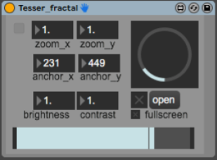

This Patch is part of the [TESSER environment](https://bitbucket.org/AdrianArtacho/tesserakt/src/master/).

# Tesser_fractal

This device does fractal **VIDEO** manipulation.

 

## Some places where I found code...

https://cycling74.com/projects/jitter-fractals/

video-fractals- is largely based on [NAT's](https://cycling74.com/author/53508692746b61d82fffaa7a)  [patch](https://cycling74.com/projects/jitter-fractals/replies/1#reply-58ed1f2343f50b22d4ba8aaa). Here's a vide of him, [playing only with the theta param of jit.rota](https://www.youtube.com/watch?v=x6rFqyD-K78).

____

# To-Do

* Document device
* Come up with a smart concept/idea
